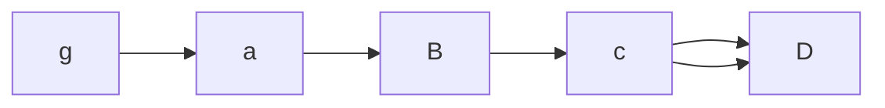

```python
print("hello world")
this is theiheloo wa 
		
```

**这就是什么东西**

**这个是加粗和加黑**


# 这里是标题

## 这个是文章的二级标题

这里写的东

1. 你好

1.1[这里是]()

### 我没有说过

#### 这个是四级标题

$$
6\infty e
$$




| 小明 |      |      |      |
| :--: | ---- | ---- | ---- |
|      |      |      |      |
|      |      |      |      |
|      |      |      |      |


